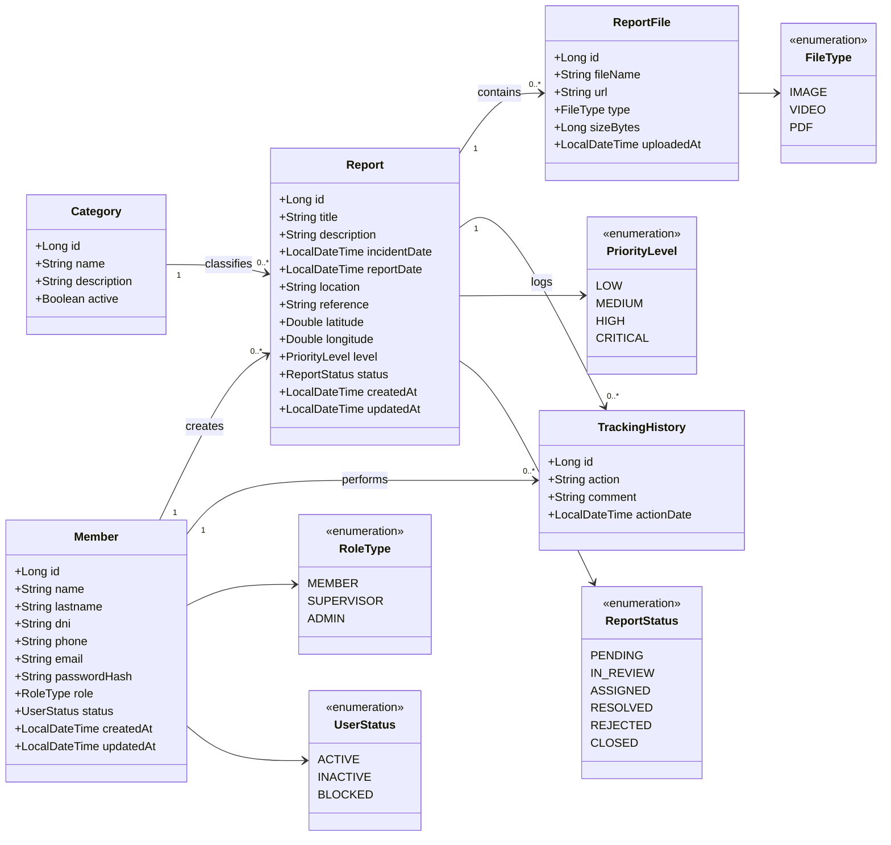
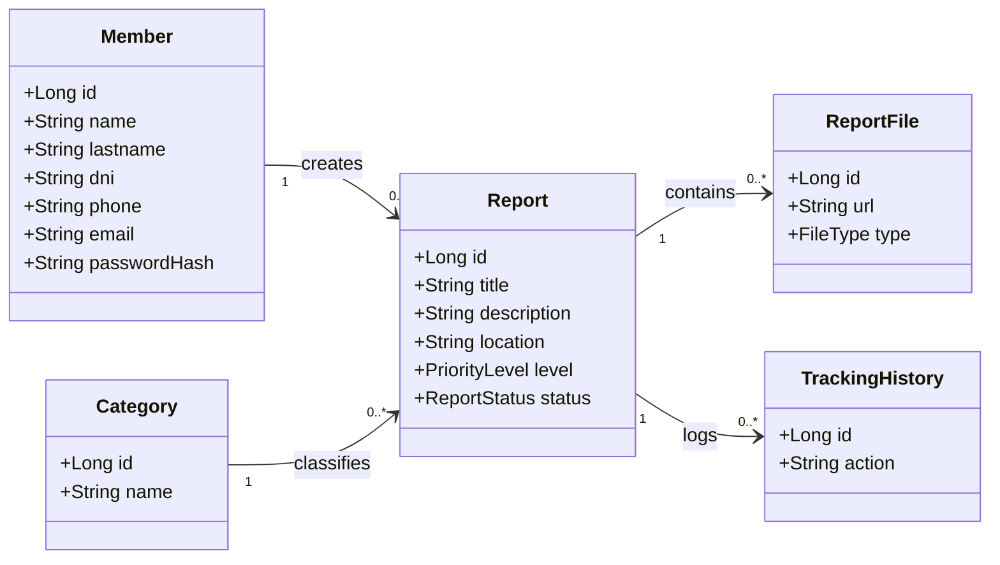

# api-reports
# Incident Report Management API



---

## 1. Presentación del Proyecto

Sistema backend para registrar, administrar y dar seguimiento a incidentes reportados por miembros de una organización o ciudadanos autorizados.

---

## 2. Problema que Resuelve

Muchas organizaciones gestionan incidentes mediante canales informales:

* llamadas
* WhatsApp
* correos
* hojas Excel

Esto provoca:

* pérdida de información
* lentitud de respuesta
* mala trazabilidad
* duplicidad de casos
* falta de métricas

---

## 3. Solución Propuesta

API centralizada donde usuarios autenticados registran reportes con ubicación y evidencia multimedia. Supervisores gestionan el ciclo de vida del caso.

---

## 4. Roles del Sistema

* MEMBER: crea reportes
* SUPERVISOR: revisa y asigna casos
* ADMIN: administración global

---

## 5. Estados del Reporte

```text
PENDING
IN_REVIEW
ASSIGNED
RESOLVED
REJECTED
CLOSED
```

---

## 6. Prioridades

```text
LOW
MEDIUM
HIGH
CRITICAL
```

---

## 7. Diagrama Mermaid



---

## 8. Flujo del Negocio

1. Usuario inicia sesión (JWT)
2. Crea reporte
3. Estado inicial: PENDING
4. Supervisor revisa
5. Se asigna responsable
6. Se resuelve
7. Se cierra

---

## 9. Redis

### Cache

* dashboard resumen
* pendientes hoy
* críticos hoy

### Queue

* alertas CRITICAL

### Rate Limit

* evitar spam

---

## 10. Arquitectura

```text
Frontend / Mobile
      ↓
Spring Boot API
      ↓
PostgreSQL
      ↓
Redis
      ↓
Storage archivos
```

---

## 11. Endpoints

```text
POST /auth/login
POST /auth/register
POST /reports
GET /reports
GET /reports/{id}
PUT /reports/{id}/status
GET /dashboard/summary
```

---

## 12. Qué decir en entrevista

Construí una API de gestión de incidentes con Spring Boot, PostgreSQL y Redis. Implementé autenticación JWT, estados de negocio, almacenamiento de evidencias y cache para dashboards.

---

## 13. Futuras Mejoras

* mapa en tiempo real
* app móvil
* exportar PDF
* notificaciones push
* IA para imágenes
